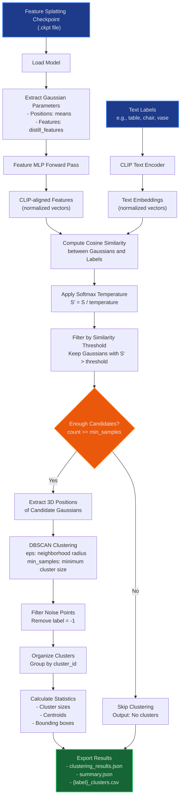

# 3D Feature Clustering Theory

This document explains the theoretical foundations and algorithmic details behind the 3D clustering pipeline for feature splatting Gaussians.

## Table of Contents

- [3D Feature Clustering Theory](#3d-feature-clustering-theory)
  - [Table of Contents](#table-of-contents)
  - [Overview of Topics and Further Reading](#overview-of-topics-and-further-reading)
    - [Core Technologies](#core-technologies)
    - [Mathematical Foundations](#mathematical-foundations)
    - [Applications](#applications)
  - [Pipeline Flowchart](#pipeline-flowchart)
  - [Detailed Step-by-Step Explanation](#detailed-step-by-step-explanation)
    - [Step 0: Model Loading and Initialization](#step-0-model-loading-and-initialization)
    - [Step 1: Text Encoding with CLIP](#step-1-text-encoding-with-clip)
    - [Step 2: Gaussian-Text Similarity Computation](#step-2-gaussian-text-similarity-computation)
    - [Step 3: Similarity Filtering](#step-3-similarity-filtering)
    - [Step 4: Spatial Clustering with DBSCAN](#step-4-spatial-clustering-with-dbscan)
    - [Step 5: Results Organization and Export](#step-5-results-organization-and-export)
  - [Key Algorithmic Insights](#key-algorithmic-insights)
    - [Feature Space Alignment](#feature-space-alignment)
    - [Multi-Scale Processing](#multi-scale-processing)
    - [Parameter Interdependencies](#parameter-interdependencies)
    - [Robustness Considerations](#robustness-considerations)

---

## Overview of Topics and Further Reading

The 3D clustering pipeline combines several key concepts from computer vision, machine learning, and 3D geometry:

### Core Technologies

1. **Feature Splatting**: Extension of 3D Gaussian Splatting with semantic features
   - [3D Gaussian Splatting for Real-Time Radiance Field Rendering](https://repo-sam.inria.fr/fungraph/3d-gaussian-splatting/)
   - [Feature Splatting: Language-Driven Physics-Based Scene Synthesis](https://feature-splatting.github.io/)

2. **CLIP (Contrastive Language-Image Pre-training)**: Vision-language model for semantic understanding
   - [Learning Transferable Visual Representations](https://arxiv.org/abs/2103.00020)
   - [OpenAI CLIP Repository](https://github.com/openai/CLIP)

3. **DBSCAN Clustering**: Density-based spatial clustering algorithm
   - [A Density-Based Algorithm for Discovering Clusters](https://www.aaai.org/Papers/KDD/1996/KDD96-037.pdf)
   - [Scikit-learn DBSCAN Documentation](https://scikit-learn.org/stable/modules/generated/sklearn.cluster.DBSCAN.html)

### Mathematical Foundations

- **Cosine Similarity**: Measure of similarity between high-dimensional vectors
- **Softmax Temperature**: Controls the sharpness of probability distributions
- **Density-Based Clustering**: Spatial clustering based on local point density
- **Feature Distillation**: Transfer of knowledge from large models to compact representations

### Applications

- **3D Scene Understanding**: Semantic segmentation of 3D environments
- **Object Detection in 3D**: Locating and clustering objects by semantic labels
- **Interactive 3D Editing**: Selecting and manipulating objects in 3D scenes

---

## Pipeline Flowchart



---

## Detailed Step-by-Step Explanation

### Step 0: Model Loading and Initialization

**Purpose**: Load the trained feature splatting model and extract Gaussian parameters.

**Input**:

- Feature splatting checkpoint file (`.ckpt`)

**Process**:

1. **Checkpoint Loading**: Load the PyTorch checkpoint containing the complete model state
2. **Model Reconstruction**: Instantiate `FeatureSplattingModel` with correct configuration
3. **Parameter Extraction**: Extract key Gaussian parameters:
   - `means`: 3D positions of Gaussians (N × 3)
   - `distill_features`: Distilled semantic features (N × feature_dim)
   - Other parameters: scales, rotations, opacities, colors

**Mathematical Foundation**:

- Each Gaussian represents a point in 3D space with associated semantic features
- Feature distillation embeds CLIP-like semantic understanding into compact vectors
- The feature MLP maps distilled features to CLIP-aligned feature space

**Code Reference**: `ModelLoader` in `pytorch_utils.py`

---

### Step 1: Text Encoding with CLIP

**Purpose**: Convert text labels into high-dimensional semantic embeddings.

**Input**:

- List of text labels (e.g., ["table", "chair", "vase"])

**Process**:

1. **Tokenization**: Convert text to CLIP tokens
2. **Text Encoding**: Pass through CLIP text encoder
3. **Normalization**: L2-normalize embeddings for cosine similarity

**Mathematical Foundation**:

```python
text_embedding = normalize(CLIP_text_encoder(tokenize(label)))
||text_embedding|| = 1
```

**Key Properties**:

- Text embeddings live in the same semantic space as visual features
- Normalization enables cosine similarity computation
- CLIP training ensures semantic alignment between text and visual concepts

**Code Reference**: `TextEncoder` in `pytorch_utils.py`

---

### Step 2: Gaussian-Text Similarity Computation

**Purpose**: Compute semantic similarity between each Gaussian and each text label.

**Input**:

- Gaussian distilled features (N × feature_dim)
- Text embeddings (M × feature_dim)

**Process**:

1. **Feature Mapping**: Pass distilled features through feature MLP
2. **Feature Normalization**: L2-normalize to unit vectors
3. **Similarity Computation**: Compute cosine similarity matrix
4. **Temperature Scaling**: Apply softmax temperature for calibration

**Mathematical Foundation**:

```python
clip_features = normalize(feature_MLP(distill_features))
raw_similarities = clip_features @ text_embeddings.T  # Matrix multiplication
scaled_similarities = raw_similarities / temperature
```

**Cosine Similarity Properties**:

- Range: [-1, 1], where 1 = identical, 0 = orthogonal, -1 = opposite
- Scale-invariant: Only considers direction, not magnitude
- Computationally efficient: Simple dot product after normalization

**Temperature Scaling**:

- `temperature < 1`: Sharpens distribution (more confident predictions)
- `temperature > 1`: Softens distribution (less confident predictions)
- `temperature = 1`: No scaling (raw similarities)

**Code Reference**: `compute_gaussian_similarities` in `pytorch_utils.py`

---

### Step 3: Similarity Filtering

**Purpose**: Select candidate Gaussians with high semantic similarity to each label.

**Input**:

- Similarity matrix (N × M)
- Similarity threshold (e.g., 0.5)

**Process**:

1. **Thresholding**: Keep Gaussians with similarity > threshold
2. **Candidate Selection**: Extract indices and positions of selected Gaussians
3. **Statistics Analysis**: Compute similarity statistics (mean, median, std dev)

**Mathematical Foundation**:

```
candidates_mask = similarities[:, label_idx] > threshold
candidate_positions = gaussian_positions[candidates_mask]
candidate_indices = indices[candidates_mask]
```

**Threshold Selection Guidelines**:

- **High threshold (0.7-0.9)**: Very confident matches, fewer false positives
- **Medium threshold (0.4-0.6)**: Balanced precision-recall
- **Low threshold (0.1-0.3)**: Broad matching, more false positives

**Statistical Analysis**:

- **High std dev**: Label might be ambiguous or have multiple interpretations
- **Low max similarity**: Label not well-represented in the scene
- **Mean-median gap**: Indicates skewed similarity distribution

**Code Reference**: `filter_by_similarity` in `clustering_utils.py`

---

### Step 4: Spatial Clustering with DBSCAN

**Purpose**: Group spatially-coherent candidate Gaussians into distinct object instances.

**Input**:

- 3D positions of candidate Gaussians
- DBSCAN parameters: `eps` (radius), `min_samples` (minimum cluster size)

**Process**:

1. **Density-Based Clustering**: Apply DBSCAN to 3D positions
2. **Noise Filtering**: Remove points labeled as noise (-1)
3. **Cluster Validation**: Ensure clusters meet minimum size requirements

**DBSCAN Algorithm**:

```
For each point p:
    If p is already processed: continue
    Find neighbors within eps distance
    If neighbors < min_samples: mark as noise
    Else: start new cluster and expand recursively
```

**Mathematical Foundation**:

- **Eps (ε)**: Maximum distance between two samples to be neighbors
- **MinPts**: Minimum samples in a neighborhood for a core point
- **Core Point**: Has at least MinPts neighbors within eps
- **Border Point**: Within eps of a core point but not core itself
- **Noise Point**: Neither core nor border point

**Parameter Selection**:

- **Small eps**: Many small clusters, more noise
- **Large eps**: Fewer, larger clusters, risk of merging distinct objects
- **Small min_samples**: More clusters, potential false positives
- **Large min_samples**: Fewer clusters, risk of missing small objects

**Advantages of DBSCAN**:

- No need to specify number of clusters in advance
- Can find arbitrarily shaped clusters
- Robust to noise and outliers
- Identifies noise points explicitly

**Code Reference**: `apply_dbscan_clustering` in `clustering_utils.py`

---

### Step 5: Results Organization and Export

**Purpose**: Structure clustering results and export in multiple formats for analysis and visualization.

**Input**:

- Cluster labels for each candidate Gaussian
- Original Gaussian data (positions, indices, similarities)

**Process**:

1. **Cluster Organization**: Group Gaussians by cluster ID
2. **Statistics Computation**: Calculate cluster properties
3. **Multi-format Export**: Save as JSON, CSV, and summary files

**Cluster Properties**:

```
For each cluster:
    - cluster_id: Unique identifier
    - size: Number of Gaussians
    - centroid: Mean 3D position
    - bounds: Min/max coordinates (bounding box)
    - gaussian_indices: Original indices in the model
    - positions: 3D coordinates
    - similarities: Semantic similarity scores
```

**Export Formats**:

1. **clustering_results.json**: Complete hierarchical results

   ```json
   {
     "table": {
       "num_candidates": 1250,
       "num_clusters": 3,
       "clusters": [
         {
           "cluster_id": 0,
           "size": 450,
           "centroid": [1.2, 0.8, -0.5],
           "bounds": {...},
           "gaussian_indices": [...],
           "positions": [...],
           "similarities": [...]
         }
       ]
     }
   }
   ```

2. **summary.json**: High-level statistics

   ```json
   {
     "table": {"candidates": 1250, "clusters": 3, "noise": 45},
     "chair": {"candidates": 890, "clusters": 2, "noise": 23}
   }
   ```

3. **{label}_clusters.csv**: Flat format for visualization

   ```csv
   label,cluster_id,gaussian_index,x,y,z,similarity
   table,0,1045,1.2,0.8,-0.5,0.73
   table,0,1046,1.3,0.8,-0.4,0.71
   ```

**Statistical Outputs**:

- **Per-label similarity distributions**: Understanding semantic matching quality
- **Cluster size distributions**: Identifying object scale patterns  
- **Spatial distributions**: Understanding scene layout
- **Noise analysis**: Quality assessment of clustering

**Code Reference**: `save_all_results` in `io_utils.py`

---

## Key Algorithmic Insights

### Feature Space Alignment

The pipeline's success relies on proper alignment between:

- Distilled features from training
- CLIP text embeddings
- Feature MLP mapping quality

### Multi-Scale Processing

The combination of semantic similarity (global) and spatial clustering (local) enables:

- Semantic understanding: "What is this?"
- Spatial coherence: "Where are the instances?"
- Instance separation: "How many objects?"

### Parameter Interdependencies

Key parameter relationships:

- `similarity_threshold` ↔ `softmax_temp`: Control semantic selectivity
- `dbscan_eps` ↔ `dbscan_min_samples`: Control spatial clustering sensitivity
- `batch_size`: Memory vs. computation trade-off (no quality impact)

### Robustness Considerations

- **Semantic ambiguity**: Some labels may match multiple object types
- **Spatial fragmentation**: Large objects may split into multiple clusters
- **Scale sensitivity**: DBSCAN parameters may need scene-specific tuning
- **Feature quality**: Results depend on training data coverage

This pipeline effectively bridges the gap between high-level semantic understanding and low-level 3D geometry, enabling intuitive interaction with complex 3D scenes through natural language queries.
